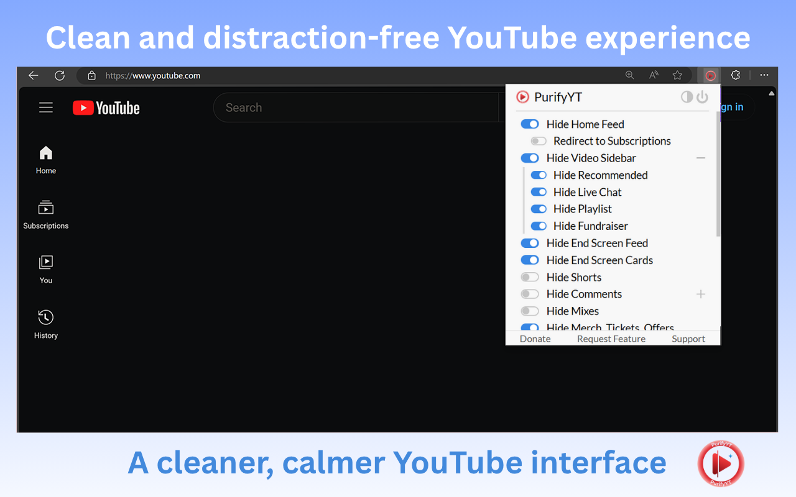

  

  <b>Remove distractions on YouTube — enjoy a cleaner, focused, and clutter-free experience.</b>

<h1 align="center">PurifyYT</h1>

  <b>Hide Shorts, Comments, Recommendations & More!</b> 
  Version 1.0.0 • Developed by <a href="https://amitdas.site">Amit Das</a>

---

## 🧩 Overview

**PurifyYT** is a lightweight browser extension that helps you take control of YouTube.  
Hide distracting elements like Shorts, comments, recommendations, and trending tabs — creating a cleaner, distraction-free interface that keeps your focus on what truly matters: the video.

---

## ⬇️ Download Extension

Get the latest version of **PurifyYT** from the **Chrome Web Store** or **GitHub Releases**.

  <!-- Chrome Web Store Button -->
  
  &nbsp;&nbsp;
  <!-- GitHub Download Button -->
  

### 🧭 Manual Installation Steps
1. Download the `.crx` file from the link above *(or install directly from the Chrome Web Store)*.  
2. Open `chrome://extensions/` in your Chrome browser.  
3. Enable **Developer Mode** (top right corner).  
4. Drag and drop the `.crx` file onto the page.  
5. PurifyYT will install automatically. ✅

---

## ⚙️ Features

✅ Hide distractions instantly:
- **Hide Homepage Feed**
- **Hide Related Videos Sidebar**
- **Hide YouTube Shorts**
- **Hide Comments & Live Chat**
- **Hide Endscreen Videowall & Cards**
- **Hide Mixes, Merch, and Offers**
- **Hide Explore & Trending Tabs**
- **Hide Channel Info & Description**
- **Disable Autoplay & Annotations**

✅ Works seamlessly on:
- **Desktop YouTube**
- **Mobile YouTube (m.youtube.com)** via Firefox on Android
- **Embedded YouTube videos**

✅ Fully customizable:
- Toggle features directly from the popup menu to personalize your viewing experience.

---

## 🖼️ Screenshots

### ✨ Clean YouTube Interface

---

### ⚙️ Extension Popup Settings

---

### 🧠 Distraction-Free Video Page

---

## 🔒 Privacy & Security

- PurifyYT does **not** collect, store, or share any personal information.  
- All settings are saved **locally** using Chrome’s storage API.  
- No analytics, trackers, or remote connections.  

Read our full [Privacy Policy](https://github.com/AmitDas4321/PurifyYT/blob/main/PRIVACY_POLICY.md).

---

## 🧰 Permissions Used

| Permission | Purpose |
|-------------|----------|
| `storage` | Saves your hide/show preferences locally in the browser. |
| `webRequest` | Detects and modifies YouTube elements as they load. |

**Host Permissions:**  
`https://www.youtube.com/*`  
`https://m.youtube.com/*`  
→ Required to hide elements directly on YouTube pages.

---

## 💬 Support

Need help or want to suggest a feature?  
📧 Email: [info@amitdas.site](mailto:info@amitdas.site)  
💡 Submit feature ideas: [Feature Request Form](https://forms.gle/y644mkWyZjyzTex69)

---

## 📜 License

This extension is © 2025 **Amit Das**.  
All rights reserved. Redistribution or modification without permission is prohibited.

---

  <b>Made with ❤️ by <a href="https://amitdas.site">Amit Das</a></b> 
  ☕ Support development: <a href="https://paypal.me/AmitDas4321">PayPal.me/AmitDas4321</a>

